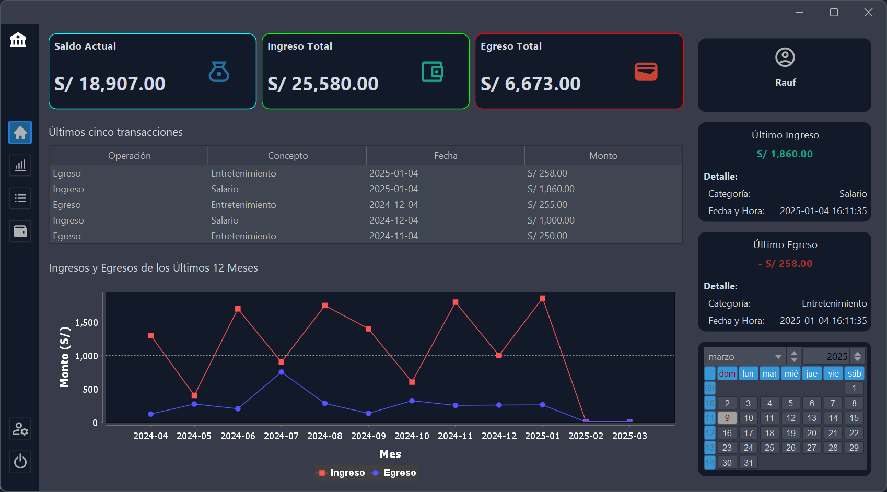
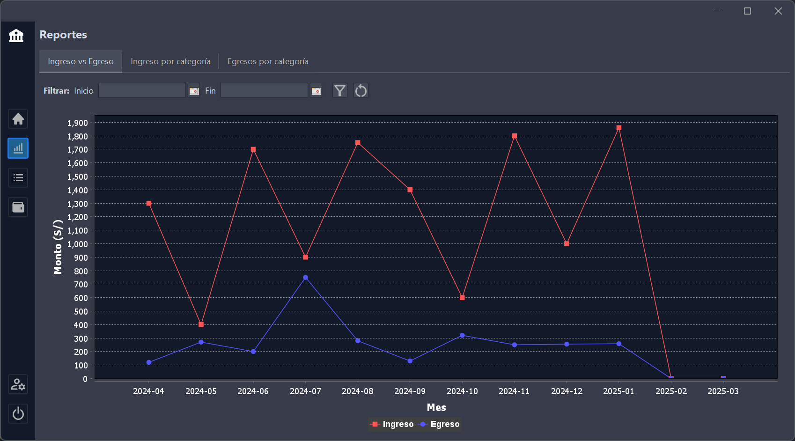
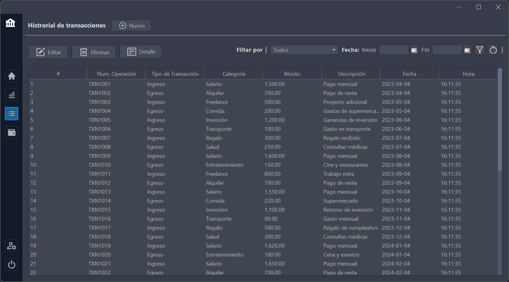

# Sistema de Control de Finanzas Personales  


## Descripción
Es una aplicación de escritorio desarrollada en **Java con Swing y Maven**. Permite gestionar ingresos y egresos, visualizar reportes gráficos y analizar datos financieros de manera eficiente. Cuenta con un sistema de autenticación seguro con contraseñas hasheadas y recuperación mediante una palabra clave.

### Características principales:
- **CRUD** completo para ingresos y egresos.
- **MVC** con **DAO y Service** para una arquitectura modular.
- **Gráficos dinámicos** con **JFreeChart**:
  - Línea: Ingreso vs Egresos.
  - Barras apiladas: Ingresos por categoría y Egresos por categoría.
- **Base de datos MySQL**.
- **Login seguro** con hashing de contraseñas.
- **Recuperación de contraseña** con palabra clave.
- **Interfaz mejorada con FlatLaf**, proporcionando un diseño visual atractivo y profesional sin afectar el rendimiento.
- **Manejo de fechas con JCalendar**
- **Sidebar dinámico**
---

## Configuración y Personalización

Esta aplicación permite modificar tanto la apariencia visual como algunos elementos de navegación:

- **Interfaz**: Se ha integrado [FlatLaf](https://www.formdev.com/flatlaf/) para mejorar la apariencia visual con un diseño moderno y profesional.
- **Iconos**: La interfaz utiliza iconos de [Google Material Icons](https://fonts.google.com/icons) y [BoxIcons](https://boxicons.com/) para mejorar la experiencia del usuario con representaciones visuales intuitivas.
- **Sidebar**: Se ha implementado un sidebar dinámico, adaptado desde [este repositorio](https://github.com/raufjavedev/sidebar-swing). Permite una navegación fluida entre las secciones de la aplicación y se puede personalizar en cuanto a colores y estructura.
- **Paneles Redondeados**: Para mejorar la estética de la interfaz, se han implementado paneles redondeados, adaptados desde [este repositorio](https://github.com/raufjavedev/rounded-panel).

---

## Configuración de la Moneda  

Para cambiar el símbolo de la moneda o el formato numérico, modifica la clase `Currency` dentro del paquete `util`.  

> **Ubicación:** `src/main/java/util/Currency.java`  

Dentro de esta clase, puedes personalizar la representación de la moneda según el país o formato requerido.

---

## Capturas de Pantalla

🖥️ _Dashboard_



🖥️ _Reportes_



🖥️ _Historial de transacciones_



---

## Instalación
### Requisitos previos
- Java 8 o superior.
- Maven instalado.
- MySQL Server.

### Pasos
1. Clonar el repositorio:
   ```sh
   git clone https://github.com/raufjavedev/personal-finance-control-system.git
   ```
2. Configurar la base de datos en MySQL.
3. Importar el archivo SQL (ver sección siguiente).
4. Compilar y ejecutar el proyecto: Ejecuta la clase principal ubicada en:
   > src/main/java/com/rj/main/Main.java

---

## Configuración de la Base de Datos

Para utilizar la aplicación, primero debes configurar la base de datos en MySQL. A continuación, se presentan los pasos recomendados, aunque puedes adaptar los nombres y métodos según tu conveniencia.

1. **Crear la base de datos** (puedes asignar el nombre que prefieras):  
   ```sql
   CREATE DATABASE nombre_base_datos;
   ```
2. **Importar el esquema y datos iniciales** (ajusta el comando según el nombre de tu base de datos y el archivo SQL ([database.sql](database.sql))):

   > ❗Debes importar la siguiente base de datos: [**`database.sql`**](database.sql)

   - **CMD**
      ```sh
      mysql -u usuario -p nombre_base_datos < database.sql
      ```
   - **PowerShell**
      ```sh
      Get-Content database.sql | mysql -u usuario -p nombre_base_datos
      ```

      > 💡También puedes importar la base de datos utilizando herramientas gráficas como *MySQL Workbench* o *phpMyAdmin*, lo que facilita la gestión y visualización de los datos.


3. Configurar el archivo `dbconfig.properties` con los datos de conexión.

   > ❗Crea el archivo `dbconfig.properties` en la ruta `src/main/resources/`.

   ```properties
   db.server=SERVER
   db.port=3306
   db.database=DATABASE_NAME
   db.user=USER
   db.password=PASSWORD
   ```

---

## Uso

1. **Registro de cuenta:** Crea una cuenta proporcionando un nombre de usuario, contraseña y una palabra clave para recuperación de acceso en caso de olvido.  
2. **Inicio de sesión:** Accede al sistema con tu usuario y contraseña registrados.  
3. **Gestión financiera:** Registra y categoriza ingresos y egresos para un mejor control de tus finanzas.  
4. **Reportes gráficos:** Visualiza estadísticas detalladas mediante gráficos dinámicos para analizar tu situación financiera.  
5. **Recuperación de cuenta:** Si olvidas tu contraseña, utiliza la palabra clave registrada para restablecer el acceso de forma segura.  


---

## Licencia 
Este proyecto está bajo la licencia [Apache 2.0](LICENSE).
